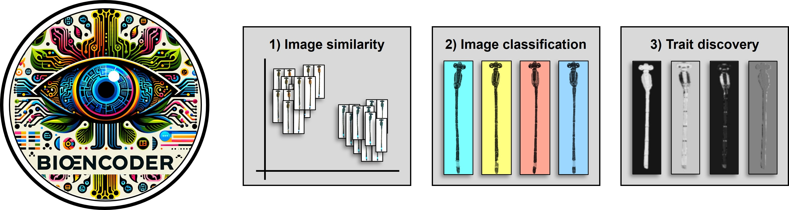

# BioEncoder workshop at Norther Arizona University

<div align="center">
    
</div>

## Background

BioEncoder is a toolkit for supervised metric learning to i) learn and extract features from images, ii) enhance biological image classification, and iii) identify the features most relevant to classification. Designed for diverse and complex datasets, the package and the available metric losses can handle unbalanced classes and subtle phenotypic differences more effectively than non-metric approaches. The package includes taxon-agnostic data loaders, custom augmentation techniques, hyperparameter tuning through YAML configuration files, and rich model visualizations, providing a comprehensive solution for high-throughput analysis of biological images.

The paper: [https://onlinelibrary.wiley.com/doi/10.1111/ele.14495](https://onlinelibrary.wiley.com/doi/10.1111/ele.14495)


## Setup

1\. Prep system:

Start a vscode-session with 10000MB RAM, 8 CPU cores, and 1 GPU. We'll work from the `\scratch` drive on monsoon rather than `\home` to have enough storage available. Make sure that `mamba` is installed and initialized on monsoon:
````
module load mambaforge
````
OPTIONAL, but recommended: [mount the drives on your computer](https://in.nau.edu/arc/overview/file-management/) so you can directly access the files and results. E.g., on windows right click on `This PC > Add a network location`:

````
\\shares.hpc.nau.edu\cirrus
````
Then enter your credentials (email + pw)

2\. Create a virtual environment with CUDA and pytorch: 

````
mamba create --prefix /scratch/mdl458/conda_envs/bioencoder-env python=3.11
mamba activate /scratch/mdl458/conda_envs/bioencoder-env
mamba install nvidia::cuda-toolkit==12.6.*

pip install torch torchvision --index-url https://download.pytorch.org/whl/cu126
````

3\. Install BioEncoder:
````
pip install bioencoder ipykernel
````


4\. Download workshop materials. First, cd into your user-folder, clone the github-repo, and download the dataset:
````
cd /scratch/mdl458

git clone https://github.com/mluerig/workshop-nau-bioencoder

curl -L -o junonia.zip "https://www.dropbox.com/scl/fi/mxr6606ei5m88piwrtd19/junonia.zip?rlkey=1gzhckdxt9640zac6014gaifh&st=y9vn8iok&dl=0"
unzip junonia.zip
````


5\. Activate the environment, and run the notebook - either in vscode or jupyter notebook / lab:

````
mamba activate /scratch/mdl458/conda_envs/bioencoder-env
# jupyter notebook scripts\01_training_junonia.ipynb
````

Happy (en)coding!

## 

